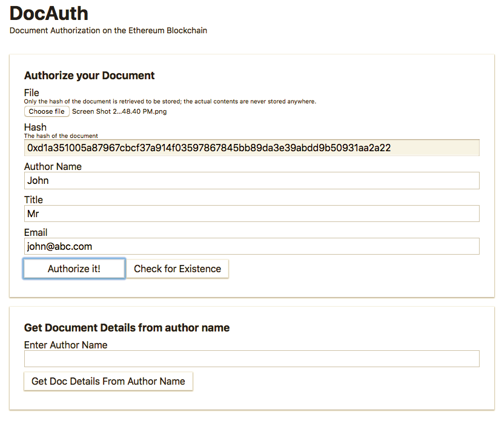

# DocAuth - Smart contract to prove and verify existence of documents

This smart contract allows you and your organisation to store documents unique identifiers in the Ethereum blockchain to prove their existance. The key advantages are anonymity, privacy, and getting a decentralized proof which can't be erased or modified by anyone (third parties or governments).
>  Document Authenticity on the [Ethereum](https://ethereum.org/) blockchain.




# Steps

Run http-server (or any other package you prefer) under public folder

```bash
npm install -g http-server
http-server public
```
Truffle Commands
```bash
npm install -g truffle
truffle migrate
truffle develop  
compile
migrate
```


* Read steps.txt for more detailed steps.

# Test

```bash
truffle test
```

# License

MIT
